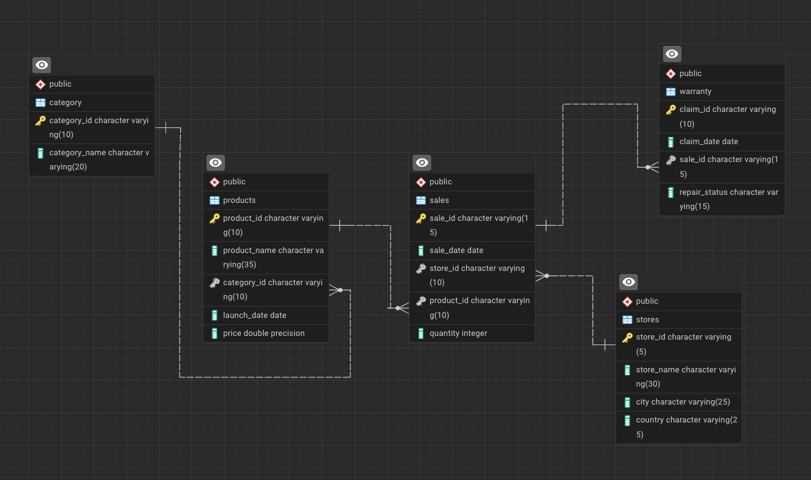

# 📊🚀 Apple Retail Sales - Analyzing Millions of Rows

    

## 📌 Project Overview

This project showcases **advanced SQL querying techniques and Power BI dashboard development** through the analysis of over **1 million rows** of Apple retail sales data. The dataset includes information about **products, stores, sales transactions, and warranty claims** across Apple retail locations globally.

Using **SQL for data extraction and Power BI for visualization**, this project provides insights into **sales trends, store performance, product profitability, and warranty analysis**.

This is an **end-to-end data analysis project**, ideal for **data analysts looking to enhance their SQL and data visualization skills**.

---
## 🛠️ Tech Stack

### **📊 Data Visualization**
- **Power BI** – Interactive dashboard for **sales trends, store performance, and product analysis**.

### **💾 Database & Query Processing**
- **PostgreSQL** – **Relational database for structured retail data storage**.
- **SQL Queries** – Used for **sales trends analysis, store performance, and warranty claims investigation**.

---

## 📊 Entity Relationship Diagram (ERD)

---

## 🚀 Key Features

✅ **100 SQL Practice Problems** covering **joins, aggregations, window functions, and business logic**.  
✅ **20 Advanced SQL Queries** with **performance tuning and real-world business analysis**.  
✅ **Comprehensive Power BI Dashboard** with **interactive visualizations** of sales, profits, and product trends.  
✅ **Large Dataset (1M+ Rows)**, testing **scalability and query optimization**.  
✅ **End-to-End Business Insights** covering **store performance, product analysis, and warranty claims**.

---

## 📂 Database Schema

The project consists of **five main tables**:

1. **stores**: Apple retail store details.
   - `store_id` – Unique identifier for each store.
   - `store_name` – Name of the store.
   - `city` – City where the store is located.
   - `country` – Country of the store.

2. **category**: Product category details.
   - `category_id` – Unique identifier for each category.
   - `category_name` – Name of the product category.

3. **products**: Apple product details.
   - `product_id` – Unique identifier for each product.
   - `product_name` – Name of the product.
   - `category_id` – Foreign key referencing the category table.
   - `launch_date` – Date when the product was launched.
   - `price` – Price of the product.

4. **sales**: Sales transactions.
   - `sale_id` – Unique identifier for each sale.
   - `sale_date` – Date of the sale.
   - `store_id` – Foreign key referencing the store table.
   - `product_id` – Foreign key referencing the product table.
   - `quantity` – Number of units sold.

5. **warranty**: Warranty claim details.
   - `claim_id` – Unique identifier for each claim.
   - `claim_date` – Date the claim was filed.
   - `sale_id` – Foreign key referencing the sales table.
   - `repair_status` – Status of the warranty claim (Paid Repaired, Warranty Void, etc.).

---

## 📈 Business Problems Addressed

### **1️⃣ Sales & Store Performance**
- Which store generates the **highest revenue**?
- What is the **total number of units sold** by each store?
- Which months experience **peak and low sales**?

### **2️⃣ Product Performance & Trends**
- What are the **top-selling products**?
- How does **product category influence sales and profit**?
- What is the impact of **product launch dates on sales performance**?

### **3️⃣ Customer & Warranty Analysis**
- Which stores have the **most warranty claims**?
- What percentage of warranty claims are **voided**?
- Do **expensive products** have higher warranty claims?

### **4️⃣ Seasonal & Regional Sales Trends**
- How do **sales fluctuate across different quarters**?
- Which country has the **best-performing stores**?
- Which products **sell better in specific regions**?

---

### **📜 SQL Techniques Used**
- **Joins & Subqueries** – Combining **multiple datasets** for deep insights.
- **Aggregations (SUM, COUNT, AVG, etc.)** – Computing **total sales, revenue, and profitability**.
- **Window Functions (RANK, PARTITION BY, LAG, LEAD)** – Identifying **best-selling products and stores**.
- **Date Functions** – Extracting **sales patterns based on months, quarters, and years**.
- **Filtering & Grouping** – Categorizing **customer segments and regional sales trends**.

---

## 📊 Power BI Dashboard

### **Dashboard Highlights**
✅ **Total Sales**  
✅ **Store-wise Performance**  
✅ **Top Revenue-Generating Products**  
✅ **Seasonal Sales Trends**  
✅ **Warranty Claims Analysis**  

---

## 📈 Key SQL Insights

- **Top 5 stores generate 40% of total revenue**, indicating the need for expansion in other regions.
- **Phones & MacBooks drive the highest sales**, while **Accessories & Peripherals have the lowest profit margins**.
- **December is the peak sales month**, while **January experiences the lowest sales**.
- **25% of warranty claims are voided**, mostly for **products purchased during promotional sales**.
- **Store location impacts sales**, with **urban stores outperforming rural stores**.

---

## 🚀 Future Enhancements

📊 **Predictive analytics to forecast sales trends**.  
📉 **Customer segmentation for personalized marketing**.  
📈 **Automating Power BI dashboard updates**.  
🔍 **Advanced correlation analysis for business decisions**.  

---

## 🎯 Conclusion

The **Apple Retail Sales Analysis** project demonstrates **advanced SQL querying and Power BI dashboard development** for **real-world business insights**.

By leveraging **SQL for data extraction and Power BI for visualization**, this project enables businesses to:
- Improve **sales performance and revenue forecasting**.
- Identify **top customers and high-revenue products**.
- Optimize **store operations and inventory management**.

---
